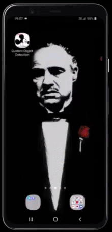

# Custom Object Detection on Android using TF Lite
An end-to-end tutorial to train a custom object detection model and deploy it on Android using TensorFlow Lite.

**Note:** [TF Lite Model Maker](https://www.tensorflow.org/lite/models/modify/model_maker) is now obsolete and is replaced by [MediaPipe Model Maker](https://developers.google.com/mediapipe/solutions/model_maker). The below Colab notebook will therefore not work to train new models. 

## Steps:

1. Prepare your dataset and label them in PascalVOC format using [LabelImg](https://github.com/tzutalin/labelImg).

2. Programmatically convert all the raw images in your dataset in the `JPEG` format using this [script](https://github.com/NSTiwari/Custom-Object-Detection-on-Android-using-TF-Lite/blob/master/convert_images_to_jpeg.py). Doing so will ensure that you don't face any error while loading your dataset during model training.

3. Once you've converted the raw images, partition the dataset into train and test data in the following directory structure. 
```
<your_dataset_name.zip>
|__ train
|    |__ images (all training image files - *.jpg)
|    |__ annotations (all training annotation files - *.xml)
|__ test
     |__ images (all test image files - *.jpg)
     |__ annotations (all test annotation files - *.xml) 
```
Once done, upload your zipped dataset on Kaggle/Google Drive.
 
4. Clone the repository on your local machine.
 
5. Sign in to your Google account and upload the `Custom_Object_Detection_using_TF_Lite_Model_Maker.ipynb` notebook on Colab.

6. Run the notebook cells one-by-one by following the instructions.

7. Once the TF Lite model is downloaded, copy the `model.tflite` model file inside `Custom-Object-Detection-on-Android-using-TF-Lite/Android_App/app/src/main/assets` directory.

8. Open the project in Android Studio and let it build itself for some time.

9. Open `MainActivity.kt` file and edit **Line 130** by replacing `<your_model.tflite>` with the name of your actual TF Lite model.

10. Build the project and install it on your phone. Enjoy your own custom-built object detector app.


## Demo Output:




